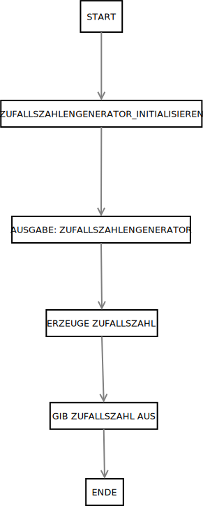

# RNG-Random-Number-Generator-

## Beschreibung

Dieses Projekt ist ein Zufallszahlengenerator, der mit Java erstellt wurde. Er ermöglicht das erstellen von Zufallszahlen.

## Funktionen

* Erstellen von Zufallszahlen.
* Ausgabe von Zufallszahlen.

## Anwendungslogik 

## Autor

* \[Dennis Garscha]
